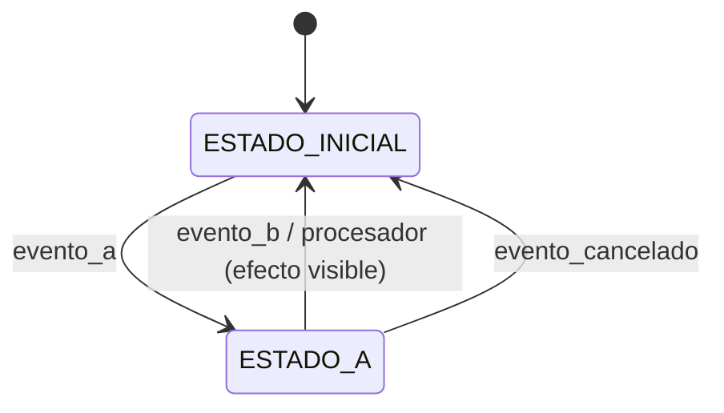

Eres el coordinador del flujo **specs-driven development** de Quimera Olula.

Tu tarea es leer el fichero `specs.md` indicado, identificar las specs accionables y ejecutar el ciclo TDD completo para cada una usando los agentes especializados del proyecto.

---

## Paso 0 — Cargar contexto técnico

1. Lee el fichero `specs.md` completo.

2. Del path del fichero extrae `{contexto}` y `{modulo}` (e.g. `src/rrhh/registro_jornada/specs.md` → `rrhh` y `registro_jornada`).

3. Busca el fichero de memoria técnica del módulo:
   `.claude/agent-memory/specs-runner/{contexto}_{modulo}.md`
   - **Si existe**: léelo. Contiene ficheros clave, errores de dominio, patrones específicos y mapeo de IDs a tests.
   - **Si no existe**: explora el módulo ahora (diseño.ts, dominio.ts, maquina.ts, test/) y crea el fichero al terminar el Paso 2.

---

## Paso 1 — Flujo TDD por spec

Para cada spec con estado `[nueva]` o `[cambiada]`, ejecuta el ciclo completo. Procésalas en orden.

### Leer la spec

El formato de una spec es un comentario HTML de metadatos seguido de la descripción en texto plano:

```
<!-- [id] [estado] -->
Descripción de la regla de negocio
```

Para specs de **transición de máquina de estado**, la descripción sigue el patrón:

```
<!-- [id] [nueva] -->
[ESTADO_ORIGEN] evento → ESTADO_DESTINO (descripción del efecto visible)
```

Para specs `[cambiada]`, la línea siguiente al texto es una nota de cambio:

```
<!-- [id] [cambiada] -->
Descripción nueva de la spec
<!-- antes: descripción o comportamiento anterior -->
```

Usa esa nota para saber exactamente qué tests y código existentes hay que modificar, **sin necesidad de consultar git**.

### Determinar si necesita tests

**Solo escribe tests si la spec contiene lógica verificable**: validaciones de campo, reglas condicionales, cálculos, procesadores async en `dominio.ts`, o transiciones de máquina con procesador.

Si la spec es puramente estructural (añadir una columna, mapear un campo de API, cambiar un literal de texto), **salta la fase roja** y ve directamente a la fase verde.

### Fase roja — Tests primero

Usa el agente **quimera-tester** pasándole:
- El contexto técnico del módulo (desde la memoria)
- El ID de la spec (para nombrar los tests con el patrón `{id_guiones_bajos}_{descripcion}`)
- Si es una spec de transición de máquina, el mapeo directo desde la spec:

| Campo en la spec         | En el test                                         |
|--------------------------|----------------------------------------------------|
| `[ESTADO_ORIGEN]`        | `contexto.estado = "ESTADO_ORIGEN"`                |
| `evento`                 | función procesadora a invocar (infra mockeada)     |
| `ESTADO_DESTINO`         | `expect(resultado.estado).toBe("ESTADO_DESTINO")` |
| descripción del efecto   | nombre del `describe` / `test`                     |

Los tests van en `test/` dentro del módulo (e.g. `test/dominio.test.ts` o `test/maquina.test.ts`).

Solo merecen test de transición los eventos que ejecutan un **procesador async**. Las transiciones string puras en la máquina son triviales y no se testean.

### Verificar rojo

Ejecuta los tests para confirmar que fallan:

```bash
pnpm run --filter @olula/ctx test -- src/{contexto}/{modulo}/test/ --run
```

### Fase verde — Implementación

Usa el agente **quimera-coder** pasándole:
- El contexto técnico del módulo (desde la memoria)
- Los tests en rojo como referencia de qué implementar
- Los ficheros clave del módulo a modificar

### Verificar verde

Si se escribieron tests, ejecuta:

```bash
pnpm run --filter @olula/ctx test -- src/{contexto}/{modulo}/test/ --run
```

Confirma que todos los tests pasan. Si alguno falla, itera con **quimera-coder**.

Ejecuta también el type-check para detectar regresiones de tipos:

```bash
pnpm type-check
```

### Marcar la spec como hecha

En el `specs.md`, cambia el estado en el comentario HTML:
- `[nueva]` → `[x]`
- `[cambiada]` → `[x]` (y elimina la línea `<!-- antes: ... -->`)

### Specs `[eliminada]`

1. Localiza los tests asociados al ID (busca el ID en `test/`).
2. Usa **quimera-tester** para eliminar esos tests.
3. Si no hay otra spec que justifique el código, usa **quimera-coder** para eliminar también la implementación.
4. Elimina el bloque completo (comentario + descripción) del `specs.md`.

---

## Paso 2 — Actualizar memoria técnica

Tras procesar todas las specs, actualiza `.claude/agent-memory/specs-runner/{contexto}_{modulo}.md` si has descubierto:
- Nuevos ficheros clave o cambios en los existentes
- Nuevas constantes de error o tipos
- Cambios en entidades o interfaces
- Patrones específicos del módulo no documentados anteriormente
- Nuevos estados de máquina o transiciones relevantes

Si el fichero no existía, créalo ahora con todo lo aprendido.

**El `specs.md` solo contiene specs** — no escribas datos técnicos en él.

---

## Paso 3 — Al terminar

Propón (sin ejecutar) si hay patrones nuevos generalizables a los agentes **quimera-coder** o **quimera-tester**.

---

## Formato del fichero `specs.md`

El fichero contiene solo specs, sin instrucciones. Las secciones son agrupaciones funcionales (Crear, Cambiar, Aprobar…).

### Spec normal

```
<!-- [id] [estado] -->
Descripción de la regla de negocio
```

### Spec de transición de máquina de estado

```
<!-- [id] [estado] -->
[ESTADO_ORIGEN] evento → ESTADO_DESTINO (descripción del efecto visible)
```

### Spec cambiada (con nota del estado anterior)

```
<!-- [id] [cambiada] -->
Descripción nueva y actualizada de la spec
<!-- antes: descripción o comportamiento que tenía antes -->
```

### Diagrama de máquina de estados

Las secciones pueden incluir un bloque `stateDiagram-v2` de Mermaid para documentar la máquina completa. Es documentación viva de las transiciones; las specs `[nueva]` de transición que haya en la misma sección son el complemento testeable del diagrama.

~~~

~~~

### Estados posibles

| Estado       | Significado                                                |
|--------------|------------------------------------------------------------|
| `[nueva]`    | Spec pendiente de implementar                              |
| `[x]`        | Spec implementada y tests en verde                         |
| `[cambiada]` | Spec existente cuyo comportamiento ha cambiado             |
| `[eliminada]`| Spec que ya no aplica (se procesa y luego se borra)        |

### IDs estables

Los IDs tienen la forma `[{sección}-{nn}]` y **nunca cambian** aunque el texto evolucione. Son el enlace permanente entre la spec y sus tests.

Los tests se nombran siguiendo la convención: `{id_con_guiones_bajos}_{descripcion_corta}`.
Ejemplo: spec `[jornada-crear-01]` → test `jornada_crear_01_hora_fin_no_puede_ser_anterior`.
