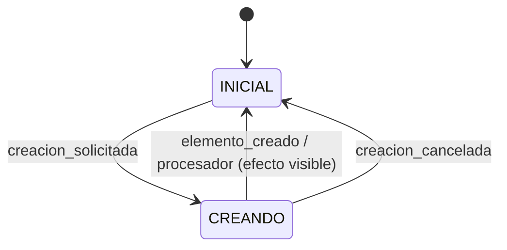
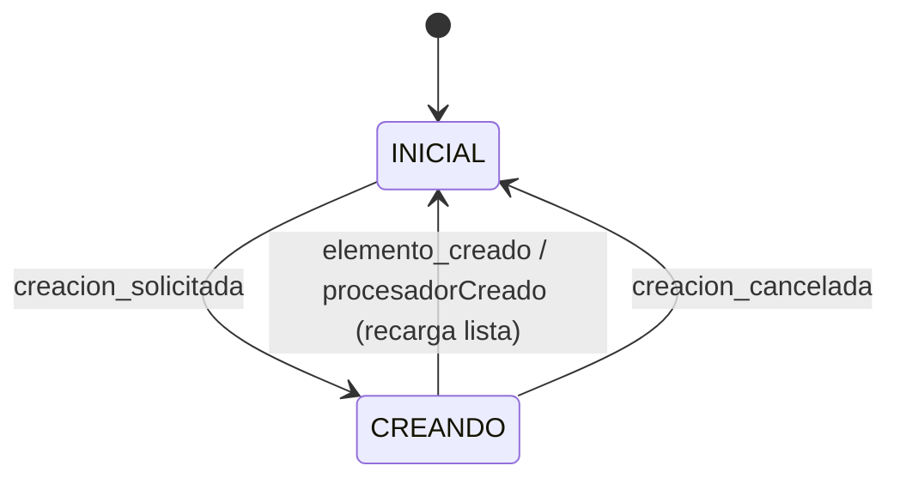

# Desarrollo mediante specs

Los módulos del proyecto se desarrollan mediante un flujo **specs-driven** que separa la especificación del comportamiento de las instrucciones al agente. El fichero `specs.md` de cada módulo contiene exclusivamente specs; el skill `specs-runner` orquesta el ciclo TDD para implementarlas.

---

## Conceptos clave

**Spec** — Una regla de negocio o comportamiento concreto del módulo, expresada en lenguaje natural. Cada spec tiene un ID estable que la vincula a sus tests para siempre.

**`specs.md`** — El fichero de especificaciones. No contiene instrucciones al agente: solo specs agrupadas por sección funcional y, opcionalmente, diagramas de estado Mermaid.

**Memoria técnica** — Fichero en `.claude/agent-memory/specs-runner/{contexto}_{modulo}.md` que contiene el contexto técnico del módulo: ficheros clave, patrones, constantes de error, mapeo de IDs a tests. Los agentes lo leen antes de actuar y lo actualizan al terminar.

**`specs-runner`** — Skill que coordina el ciclo completo: lee las specs accionables, invoca a `quimera-tester` (fase roja) y a `quimera-coder` (fase verde), verifica con los tests y marca la spec como hecha.

---

## Formato del fichero `specs.md`

```
<!-- [id] [estado] -->
Descripción de la regla de negocio en lenguaje natural
```

Para specs de **transición de máquina de estado**:

```
<!-- [id] [estado] -->
[ESTADO_ORIGEN] evento → ESTADO_DESTINO (descripción del efecto visible)
```

Para specs **cambiadas** (con nota del comportamiento anterior):

```
<!-- [id] [cambiada] -->
Descripción nueva y actualizada
<!-- antes: descripción o comportamiento anterior -->
```

### Estados posibles

| Estado       | Significado                                                    |
|--------------|----------------------------------------------------------------|
| `[nueva]`    | Spec pendiente de implementar                                  |
| `[x]`        | Spec implementada y tests en verde                             |
| `[cambiada]` | Spec existente cuyo comportamiento ha cambiado                 |
| `[eliminada]`| Spec que ya no aplica (se procesa y luego se borra del fichero)|

### IDs estables

Los IDs tienen la forma `[{sección}-{nn}]` y **nunca cambian** aunque el texto evolucione. Son el enlace permanente entre la spec y sus tests.

Convención de nombrado de tests: `{id_guiones_bajos}_{descripcion_corta}`.
Ejemplo: spec `[jornada-crear-01]` → test `jornada_crear_01_hora_fin_no_puede_ser_anterior`.

### Diagramas de estado

Las secciones que describen una máquina de estado incluyen un bloque `stateDiagram-v2` Mermaid antes de las specs de transición. Es documentación viva; las specs `[nueva]` de transición son el complemento testeable del diagrama.



---

## Asociar specs a un módulo existente

Cuando un módulo ya existe pero no tiene fichero de specs.

### 1. Crear `specs.md`

Crea `packages/contextos/src/{contexto}/{modulo}/specs.md` con el siguiente esqueleto:

```markdown
# {Nombre del módulo}

## Specs

### {Sección funcional}

<!-- [{sección}-01] [nueva] -->
Primera regla de negocio a implementar
```

El fichero no debe contener ninguna instrucción. Solo specs y, si aplica, diagramas Mermaid.

### 2. Crear la memoria técnica

Crea `.claude/agent-memory/specs-runner/{contexto}_{modulo}.md` con el contexto técnico que los agentes necesitan conocer:

```markdown
# Memoria técnica — {contexto} / {modulo}

## Comando de tests

```bash
pnpm run --filter @olula/ctx test -- src/{contexto}/{modulo}/test/ --run
```

## Ficheros clave

| Fichero | Contenido |
|---|---|
| `diseño.ts` | ... |
| `dominio.ts` | ... |
| `infraestructura.ts` | ... |
| `maquina.ts` | ... |

## Patrones específicos

(Validaciones, errores de dominio, comportamientos no obvios...)

## Mapeo de specs a tests

| ID spec | Fichero de test | Función/describe |
|---|---|---|


Si no tienes claro el contenido, puedes dejarlo vacío y el skill lo rellenará en su primera ejecución al explorar el módulo.

### 3. Redactar las specs accionables

Para cada comportamiento del módulo que quieras especificar, añade una spec al `specs.md`. Asigna IDs correlativos dentro de cada sección:

- `[jornada-crear-01]`, `[jornada-crear-02]`…
- `[maestro-01]`, `[maestro-02]`…

Marca con `[nueva]` las que quieres que el skill implemente. Marca con `[x]` las que ya estaban implementadas antes de introducir las specs (no necesitan ciclo TDD, pero documentan el comportamiento).

### 4. Ejecutar el skill

Invoca el skill para implementar las specs accionables:

```
/specs-runner packages/contextos/src/{contexto}/{modulo}/specs.md
```

El skill leerá la memoria técnica, ejecutará el ciclo TDD para cada `[nueva]` y `[cambiada]`, y actualizará la memoria al terminar.

---

## Crear un nuevo módulo con specs desde el inicio

Cuando el módulo no existe todavía.

### 1. Crear la estructura de ficheros del módulo

Sigue la convención de 4 ficheros DDD. Puedes usar la plantilla en [doc/plantilla/contexto/modulo/](../plantilla/contexto/modulo/):

```
packages/contextos/src/{contexto}/{modulo}/
├── diseño.ts
├── dominio.ts
├── infraestructura.ts
├── maestro/
│   ├── diseño.ts
│   ├── dominio.ts
│   ├── maquina.ts
│   └── Maestro{Modulo}.tsx
├── detalle/
│   ├── diseño.ts
│   ├── dominio.ts
│   ├── maquina.ts
│   └── Detalle{Modulo}.tsx
└── test/
    └── dominio.test.ts
```

### 2. Crear `specs.md` con las specs iniciales

Empieza con las specs más fundamentales: las reglas de creación y validación de la entidad principal. Marca todas como `[nueva]`.

```markdown
# {Nombre del módulo}

## Specs

### {Entidad principal}

#### Crear

<!-- [{entidad}-crear-01] [nueva] -->
Primera validación de creación

<!-- [{entidad}-crear-02] [nueva] -->
Segunda validación de creación

### Listado maestro



<!-- [maestro-01] [nueva] -->
[CREANDO] elemento_creado → INICIAL (la lista se recarga tras crear)
```

### 3. Crear la memoria técnica

Igual que en el caso del módulo existente (ver paso 2 anterior). En este caso puedes empezar con los tipos básicos que ya hayas definido en `diseño.ts`.

### 4. Implementar las specs en orden

Empieza por las specs más fundamentales (validaciones de dominio puro antes que transiciones de máquina). Invoca el skill:

```
/specs-runner packages/contextos/src/{contexto}/{modulo}/specs.md
```

El ciclo TDD para cada spec:
1. `quimera-tester` escribe el test (fase roja)
2. Verifica que falla
3. `quimera-coder` implementa (fase verde)
4. Verifica que pasa
5. La spec queda marcada `[x]`

---

## Flujo de trabajo continuo

Una vez que el módulo tiene specs, el flujo para añadir o cambiar comportamiento es:

**Añadir comportamiento nuevo:**
1. Añade una spec con estado `[nueva]` y el siguiente ID disponible en la sección.
2. Ejecuta `/specs-runner`.
3. La spec queda `[x]` y la memoria técnica se actualiza.

**Cambiar comportamiento existente:**
1. Cambia el estado de la spec a `[cambiada]` y actualiza el texto.
2. Añade la nota del estado anterior: `<!-- antes: descripción anterior -->`.
3. Ejecuta `/specs-runner`.
4. La spec vuelve a `[x]` y se elimina la nota `<!-- antes: ... -->`.

**Eliminar comportamiento:**
1. Cambia el estado a `[eliminada]`.
2. Ejecuta `/specs-runner`: elimina los tests y el código asociado.
3. El skill borra la spec del fichero.

---

## Referencia rápida

| Acción | Comando |
|--------|---------|
| Implementar specs accionables | `/specs-runner {ruta}/specs.md` |
| Ejecutar solo los tests del módulo | `pnpm run --filter @olula/ctx test -- src/{contexto}/{modulo}/test/ --run` |
| Verificar tipos tras implementar | `pnpm type-check` |
