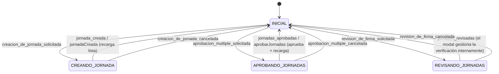

# Registro de jornada

## Specs

### Jornada

#### Crear

<!-- [jornada-crear-01] [x] -->
La hora fin de la jornada no puede ser anterior a la hora de inicio

#### Cambiar

<!-- [jornada-cambiar-01] [x] -->
La hora fin de la jornada no puede ser anterior al mayor valor de hora entre la hora de inicio de la jornada y las horas de inicio y/o fin de las pausas

#### Aprobar

<!-- [jornada-aprobar-01] [x] -->
Una jornada puede aprobarse si está en Borrador y Cerrada (con hora de fin)

### Listado maestro de jornadas

<!-- [maestro-01] [x] -->
El listado incluye el dato de minutos_jornada de la API en formato hh:mm

<!-- [maestro-02] [x] -->
El listado permite aprobar varias jornadas si todas pueden ser aprobadas (estado Borrador y Cerrada con hora fin)

<!-- [maestro-03] [x] -->
[APROBANDO_JORNADAS] jornadas_aprobadas → INICIAL (el diálogo de confirmación se cierra tras aprobar)

<!-- [maestro-03] [x] -->
El listado permite revisar la firma concatenada de las jornadas en el sistema, preguntando al usuario una fecha / hora de inicio de la comprobación. Si esta no se indica, se toma la totalidad de los eventos desde el inicio de la puesta en marcha de la aplicación.

El endpoint usado es /rrhh/registro_jornada/verificar_firma
Parámetro querystring {desde: '(timestamp)' o null}
[REVISANDO_JORNADAS] jornadas_revisadas → INICIAL (el diálogo de confirmación se cierra tras verificar)

### Detalle de jornada

<!-- [detalle-01] [x] -->
El detalle incluye el dato de minutos_jornada de la API en formato hh:mm, posicionado junto a los datos de hora inicio y hora fin
