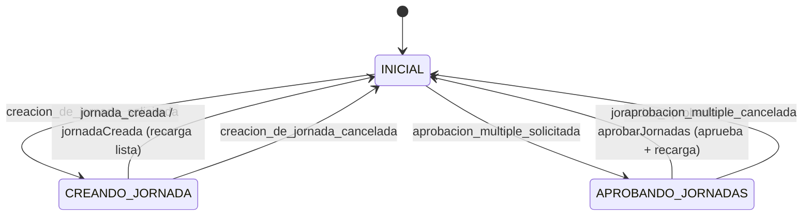

# Registro de jornada

## Ficheros afectados

### Módulo
packages/contextos/src/rrhh/registro_jornada

### Ficheros clave
- `diseño.ts` — Tipos: `RegistroJornada` (incluye `minutosJornada: number`), `NuevaJornada`, `CambiosJornada`, `PausaJornada`, `EstadoJornada`. `PatchAprobarJornada = (ids: string[]) => Promise<void>` (bulk, array de IDs)
- `dominio.ts` — Re-exporta `rrhh_comun/dominio.ts`: `registroJornadaVacio`, `metaRegistroJornada`, `minutosAHorasMinutos`, `puedeAprobarse`
- `infraestructura.ts` — Mappers API↔dominio (`registroJornadaDesdeApi`), llamadas REST. `patchAprobarJornada` usa `PATCH /registro_jornada/aprobar` con body `{ ids }` (bulk, sin ID en URL)
- `detalle/diseño.ts` — Estados y contexto del detalle: `EstadoDetalleJornada`, `ContextoDetalleJornada`
- `detalle/dominio.ts` — Procesadores de contexto: `cargarContexto`, `refrescarJornada`, `jornadaAEstado`
- `detalle/maquina.ts` — Máquina de estados del detalle de jornada
- `detalle/DetalleJornada.tsx` — Vista principal del detalle
- `crear/diseño.ts` — `NuevaJornadaForm`, `metaNuevaJornada` (con validaciones de campos para creación)
- `crear/CrearJornada.tsx` — Modal de creación de jornada
- `pausas/diseño.ts` — `PausaForm`, `metaPausaForm(jornada, pausaId?)` (función de fábrica con validaciones de intervalo y solapamiento), `pausaFormInicial`, `pausaFormDesde`
- `pausas/` — Submódulo de gestión de pausas (crear, editar, borrar)
- `maestro/diseño.ts` — `metaTablaJornada`, `ContextoMaestroJornadas` (incluye `seleccionadas: string[]`), `EstadoMaestroJornadas` (incluye `'APROBANDO_JORNADAS'`)
- `maestro/dominio.ts` — `todasPuedenAprobarse(ids, jornadas)`, `aprobarJornadas` (procesador que llama a bulk API y recarga lista)
- `maestro/maquina.ts` — Estado `APROBANDO_JORNADAS` con transiciones `jornadas_aprobadas` y `aprobacion_multiple_cancelada`; evento `seleccionadas_cambiadas` en `INICIAL`
- `maestro/AprobarJornadas.tsx` — Modal de confirmación para aprobación múltiple
- `maestro/MaestroConDetalleJornada.tsx` — Listado con multiselección; botón "Aprobar (n)" condicionado a `todasPuedenAprobarse`

## Contexto

Ejemplo de validación de campos: @packages/contextos/src/tpv/venta/pagar_con_tarjeta/pagar_con_tarjeta.ts

### Patrón de validación en MetaModelo

Las validaciones de campo se definen como funciones `(modelo) => boolean | string` en la propiedad `validacion` de cada campo del `MetaModelo`. Reciben el modelo completo para poder comparar campos entre sí. Devuelven `true` si es válido, `false` si inválido sin mensaje, o un string con el mensaje de error.

Las validaciones se añaden **en el mismo fichero donde se define el `MetaModelo`** (`dominio.ts` para edición, `crear/diseño.ts` para creación).

Las horas (`string | null` o `string`) se comparan directamente como strings porque el formato `"HH:MM"` / `"HH:MM:SS"` es lexicográficamente equivalente al orden temporal.

### MetaModelo como función de fábrica

Cuando la validación necesita acceso a contexto externo al modelo (como la jornada padre o sus otras pausas), `metaXxx` se define como función de fábrica en lugar de constante:

```typescript
export const metaPausaForm = (jornada: RegistroJornada, pausaId?: string): MetaModelo<PausaForm> => ({ ... })
```

Los componentes que usan el metadato lo llaman pasando el contexto necesario:
- Crear: `useModelo(metaPausaForm(jornada), pausaFormInicial)`
- Editar: `useModelo(metaPausaForm(jornada, pausa.id), pausaInicial)`

El `pausaId` sirve para excluir la propia pausa del chequeo de solapamiento al editar.

### Solapamiento de intervalos

Dos intervalos `[a, b]` y `[c, d]` se solapan si `a < d AND c < b`. Para intervalos sin hora de fin se usa `"99:99"` como sustituto del infinito (válido por comparación lexicográfica).

## Prompt

Lee el apartado Contexto de este fichero y sigue este flujo TDD para cada spec `[nueva]`, `[cambiada]` o `[eliminada]` que encuentres en el apartado Specs:

1. Decide si la spec necesita tests. **Solo escribe tests si la spec contiene lógica de negocio verificable**: validaciones, reglas condicionales, cálculos o renderizado condicional. Si la spec es puramente estructural (añadir una columna, mapear un campo de la API, cambiar un literal) salta los pasos 1–2 y ve directamente al paso 3.
2. Usa el agente **quimera-tester** para escribir o actualizar los tests de la spec (fase roja). Los tests van en `test/` dentro del módulo afectado.
3. Ejecuta los tests para confirmar el estado rojo: `pnpm run --filter @olula/ctx test -- src/rrhh/registro_jornada/test/ --run`
4. Usa el agente **quimera-coder** para implementar o adaptar la spec (fase verde).
5. Si se escribieron tests, ejecuta los tests para confirmar que todo pasa: `pnpm run --filter @olula/ctx test -- src/rrhh/registro_jornada/test/ --run`

Una vez realizado el cambio:

+ Actualiza los apartados Contexto y Ficheros afectados de este fichero para guardar información sobre este módulo que ayude en próximos cambios de funcionalidades (specs).

+ Propón (no lo hagas) actualizar la información asociada a los agentes quimera-coder y/o quimera-tester para adaptarlos a nuevos patrones descubiertos que sean generalizables, si los hay.

## Instrucciones de specs

### Estructura

Cada spec es una línea con la forma:

```
+ [estado] [id] Descripción de la regla de negocio
```

Para specs que describen **transiciones de estado de una máquina**, se añade el prefijo `[ESTADO_ORIGEN]` antes de la descripción:

```
+ [estado] [id] [ESTADO_ORIGEN] evento → ESTADO_DESTINO (descripción del efecto visible)
```

Este prefijo permite derivar el test directamente:

| Campo en la spec | En el test |
|---|---|
| `[ESTADO_ORIGEN]` | `contexto.estado = "ESTADO_ORIGEN"` |
| `evento` | función procesadora a invocar (con infra mockeada) |
| `ESTADO_DESTINO` | `expect(resultado.estado).toBe("ESTADO_DESTINO")` |
| descripción | nombre del `describe` / `test` |

Solo merecen spec de transición los eventos que ejecutan un **procesador async** (funciones en `dominio.ts`). Las transiciones string puras en la máquina son triviales y no se testean.

**Estados posibles:**
- `[nueva]` — spec pendiente de implementar (dispara el flujo TDD)
- `[hecha]` — spec implementada y con tests en verde
- `[cambiada]` — spec existente cuyo texto o comportamiento ha cambiado (dispara actualización de tests e implementación)
- `[eliminada]` — spec que ya no aplica (dispara la eliminación de tests e implementación asociada)

**IDs estables:** cada spec lleva un ID de la forma `[{sección}-{nn}]` que nunca cambia aunque el texto de la spec evolucione. El ID es el enlace permanente entre la spec y sus tests. Ejemplos: `[jornada-crear-01]`, `[pausa-02]`.

Las specs se agrupan por sección funcional (Crear, Cambiar, Pausas…). Dentro de cada sección el orden es cronológico de creación.

### Flujo de trabajo

**Spec `[nueva]`**

1. Añade la línea con estado `[nueva]` y el siguiente ID disponible en la sección.
2. Ejecuta el prompt de este fichero: el agente **quimera-tester** escribe los tests (fase roja) y el agente **quimera-coder** implementa (fase verde).
3. Al terminar, cambia el estado a `[hecha]`.

**Spec `[cambiada]`**

1. Cambia el estado a `[cambiada]` y actualiza el texto de la spec. Mantén el mismo ID.
2. Ejecuta el prompt: quimera-tester localiza los tests por el ID, los actualiza (nueva fase roja) y quimera-coder reimplementa.
3. Al terminar, vuelve el estado a `[hecha]`.

**Spec `[eliminada]`**

1. Cambia el estado a `[eliminada]`.
2. Ejecuta el prompt: quimera-tester elimina los tests asociados al ID y quimera-coder elimina o adapta la implementación.
3. Una vez limpio, elimina la línea entera del fichero.

---

## Specs

### Jornada

### Crear
    + [hecha] [jornada-crear-01] La hora fin de la jornada no puede ser anterior a la hora de inicio

### Cambiar
    + [hecha] [jornada-cambiar-01] La hora fin de la jornada no puede ser anterior al mayor valor de hora entre la hora de inicio de la jornada y las horas de inicio y/o fin de las pausas

### Aprobar
    + [hecha] [jornada-aprobar-01] Una jornada puede aprobarse si está en Borrador y Cerrada (con hora de fin)

### Listado maestro de jornadas

#### Flujo de estados (maestro)



    + [hecha] [maestro-01] El listado incluye el dato de minutos_jornada de la API en formato hh:mm

    + [hecha] [maestro-02] El listado permite aprobar varias jornadas si todas pueden ser aprobadas (estado Borrador y Cerrada (con hora fin))

    + [hecha] [maestro-03] [APROBANDO_JORNADAS] jornadas_aprobadas → INICIAL (el diálogo de confirmación se cierra tras aprobar)

### Detalle de jornada
    + [hecha] [detalle-01] El detalle incluye el dato de minutos_jornada de la API en formato hh:mm, posicionado junto a los datos de hora inicio y hora fin.